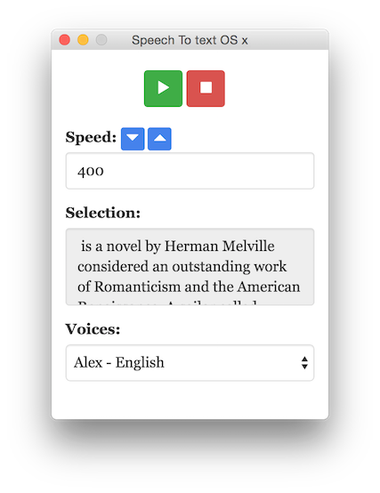

# What is Alpaca Speech?
Is a Text To Speech Desktop app for Os X, using [Node NW js](https://github.com/nwjs/nw.js).



<!-- ## Working version of app
You can download a working version of the app from [here](stt/osx64/tts.app) -->

## Gettins started

- `npm install` to install dependencies 
- install `nw` js [https://github.com/nwjs/nw.js]
- `nw .` to get preview of app

<!-- - install `nwbuild` [repo here](https://github.com/nwjs/nw-builder) `npm install nw-builder -save`
- run `nwbuild -p osx64 -o . ..` to package the app for os x. [more info here for cross os compatibility](https://github.com/nwjs/nw-builder#usage) -->

## deployment as os x desktopp app.

See [wiki - deploy](https://github.com/pietrop/alpaca_speech/wiki/Deploy).

## `say.js` dependency
`say.js` provide access to sytem text to speech.
<!-- (it's cross platform,mac,linux,pc). -->
This uses a fork of `say.js` [pietrop/say.js](https://github.com/pietrop/say.js)

modified version integrates this version of say for stop 
[https://github.com/thomascullen/voicebox/blob/6bffff743f86d9662c0a5f9e5d609b2e45216e13/say.js] and another version of say from pull request from speed controll.

See pending [pull request to integrate with main repo](https://github.com/Marak/say.js/pull/31)


<!-- which if you need to install on another project you can do so using 

```
npm install pietrop/say.js -save
``` -->


## `copy-paste` dependency

`copy-paste`[xavi-/node-copy-paste](https://github.com/xavi-/node-copy-paste) allows node to access the content of the system clipboard.

<!-- ## os x native look 

https://github.com/GoBijan/maverix -->

# prerequisites

You need to have the languages installed.
In this case `Alex - english`, and `Luca - Italian`.


